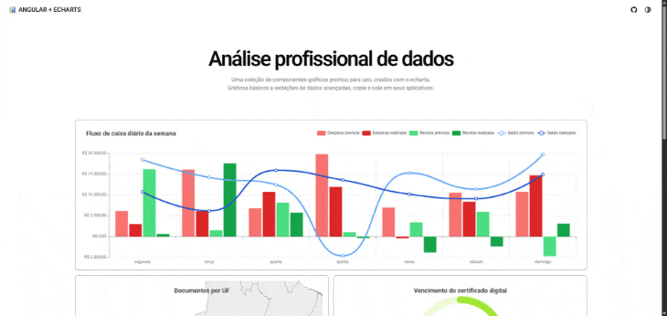

# 📊 Demonstração de Gráficos com Angular + ECharts



Este projeto é uma página de demonstração de gráficos interativos criada com **Angular** e a poderosa biblioteca **Apache ECharts**.

O objetivo é apresentar diversos tipos de gráficos em um único lugar, servindo como referência ou base para outros projetos Angular que necessitem de visualizações de dados.

---

## 🚀 Tecnologias Utilizadas

- [Angular](https://angular.io/)
- [Apache ECharts](https://echarts.apache.org/)
- [TypeScript](https://www.typescriptlang.org/)

---

## 📌 Funcionalidades

- Integração completa do ECharts com componentes Angular
- Gráficos dinâmicos e reativos
- Atualização de dados e configurações em tempo real
- Organização modular dos exemplos

---

## 📈 Exemplos de Gráficos

✅ Gráfico de Linhas  
✅ Gráfico de Barras  
✅ Gráfico de Pizza  
✅ Gráfico de Área  
✅ Gráfico de Dispersão (Scatter)  
✅ Gráfico de Radar  
✅ Gráfico de Velocímetro (Gauge)  
✅ Gráfico de Funil  
✅ Mapa (GeoMap)  
✅ e muito mais!

---

## ▶️ Como Executar Localmente

```bash
# Clone o repositório
git clone https://github.com/hendersonkleber/angular-echarts-examples.git

# Acesse a pasta do projeto
cd angular-echarts-examples

# Instale as dependências
npm install

# Rode o servidor de desenvolvimento
ng serve

# Acesse em http://localhost:4200
```

---

## 🙋‍♂️ Contribuição

Contribuições são bem-vindas! Sinta-se à vontade para abrir issues ou enviar pull requests com melhorias, novos gráficos ou correções.

---

## ✨ Inspiração

Este projeto foi inspirado pela necessidade de ter uma vitrine visual dos gráficos disponíveis no ECharts dentro de um ambiente Angular moderno e escalável.
